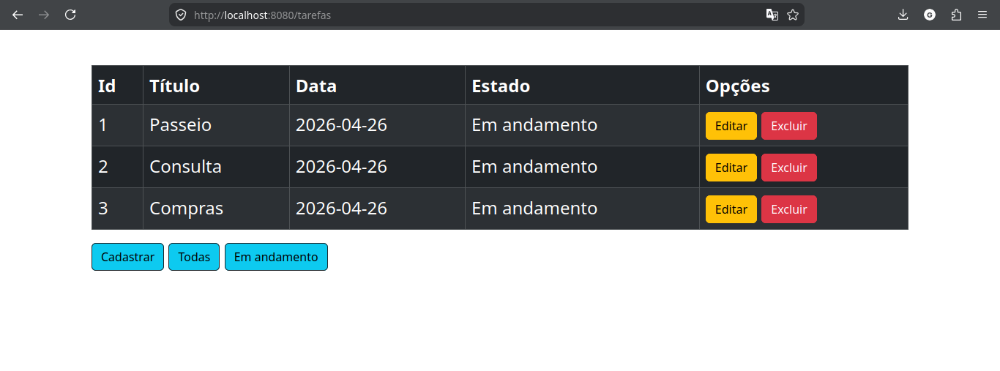
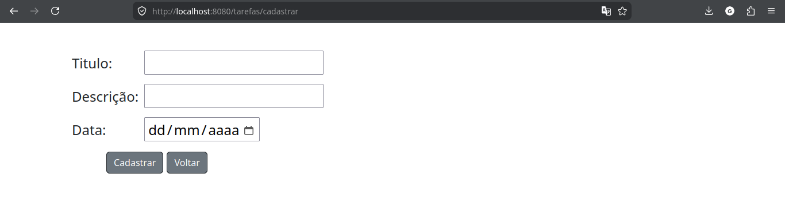
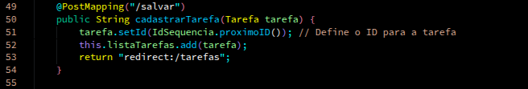
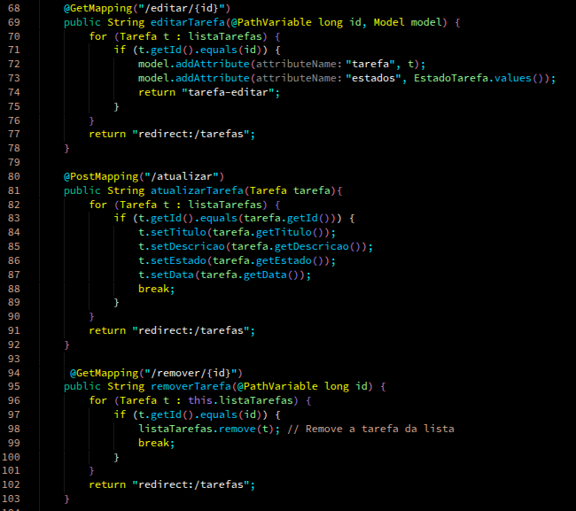
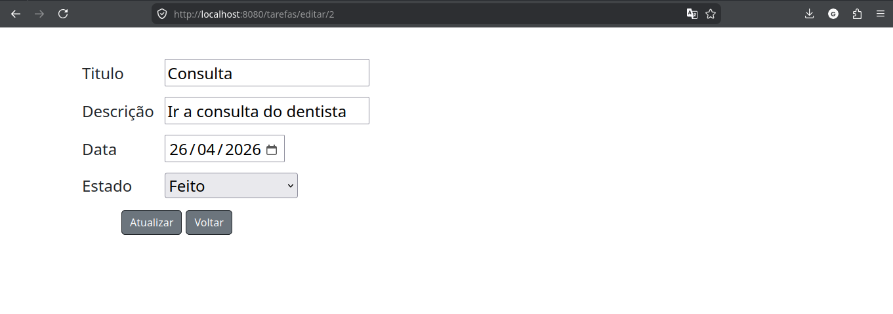
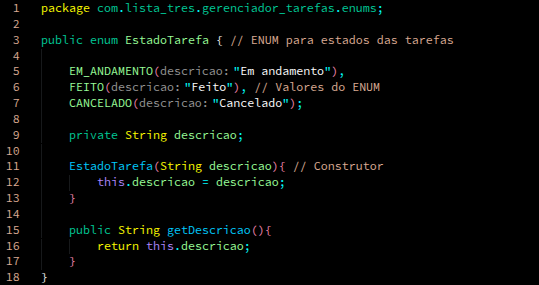
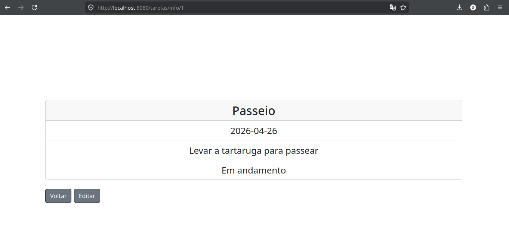
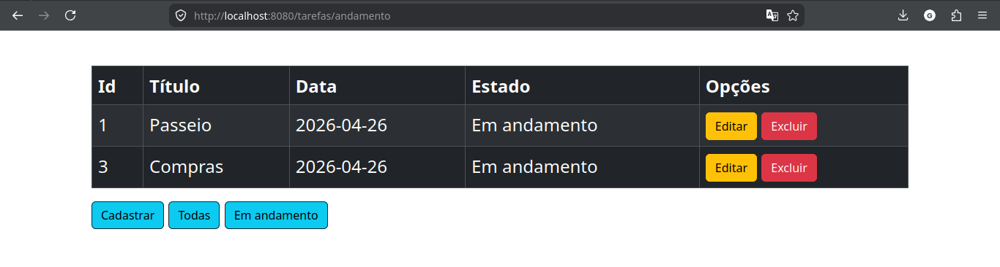
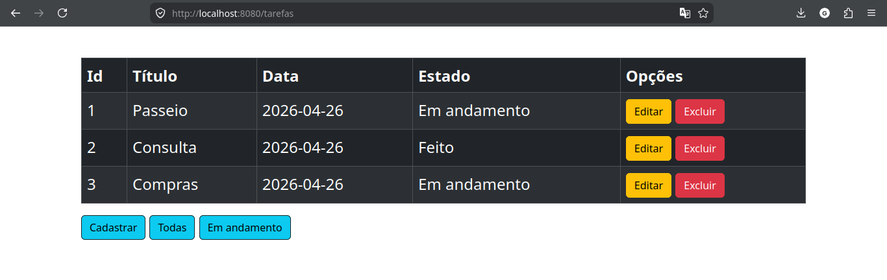

# Lista de exercicios 3

## 1. Criando a Aplicação
Inicialmente implemente uma aplicação web usando o framework Java Spring (você
pode seguir o passo a passo visto em aula, clicando aqui).
Inclua as seguintes dependências:
* **spring-boot-starter-web:** para criar as rotas da aplicação e demais recursos
para disponibilizar páginas web;
* **spring-boot-starter-thymeleaf:** para permitir o uso do Thymeleaf, que serve
como motor de templates (para renderizar os arquivos HTML com dados
dinâmicos, geralmente vindo da controller).
* **spring-boot-devtools:** módulo (opcional) que ajuda os desenvolvedores
durante o processo de desenvolvimento, oferecendo funcionalidades que
aumentam a produtividade.

---

## 2. Organizando a estrutura do Projeto
Organizaremos o projeto com uma divisão padrão. Crie os
seguinte pacotes dentro da pasta src/main/java/{Group Id}/{Artifact Id}/:
* **models** → onde está a classe Tarefa (que representa cada tarefa).
* **controllers** → onde está a classe TarefaController (controla as rotas e as
ações).
* **templates** (já existe em src/main/resources) → onde ficam os arquivos
HTML com Thymeleaf (nossas páginas visuais)

---

## 3. Criação da classe Tarefa.java
A classe Tarefa é o modelo de dados que representa as tarefas que desejamos
gerenciar.
Implemente dentro do pacote models uma classe chamada Tarefa.java. Essa classe
deve possuir os seguintes atributos:

```java
private Long id;
private String titulo;
private String descricao;
private LocalDate data;
```

Implemente os métodos getters e setters para acessar e modificar esses atributos.

---

## 4. A classe TarefaController.java

Após a criação da classe Tarefa, implementaremos uma classe chamada
TarefaController. O objetivo dessa classe é expor funcionalidades que permitam
gerenciar tarefas por meio de requisições HTTP, como adicionar, listar e remover
itens da lista.
* Os dados serão armazenados em
uma estrutura do tipo ArrayList diretamente dentro da própria Controller
* A classe TarefaController deve possuir as seguintes rotas para as funcionalidades
principais

### 4.1 Crie a classe TarefaController  
Dentro do pacote controllers, crie a classe conforme o exemplo abaixo. Adicione
o atributo listaDeTarefas do tipo ArrayLis

---

## 5. Listando as Tarefas
Para listar as tarefas criadas, na controller, vamos criar e expor um método chamado
listarTarefas. Esse método tem como objetivo obter todas tarefas armazenadas
no ArrayList e retornar uma página HTML com essas informações montadas

### 5.1 Crie página tarefa-lista.html
O objetivo da página tarefa-lista.html é apresentar todas as tarefas em uma
tabela HTML. Para cada tarefa, será exibido o título, descrição, botão de editar e de
excluir.



## 6. Cadastrando uma Tarefa
Para realizar o cadastro de tarefas vamos criar e expor outro método na classe
TarefaController chamado criarTarefa. O processo de cadastro será feito
em duas etapas: i) a primeira etapa será a implementação de um método que
permita chamar o formulário de cadastro de tarefas; ii) a segunda etapa é
implementar outro método para receber os dados vindos do formulário de cadastro
de tarefas.



---

### 7. Implemente o método para salvar uma tarefa;  

Aqui tive que implementar uma camada util para fazer um sequenciador de id, 
por ter usado o tipo Long no atributo id



### 8. Implemente as funcionalidades para edição e exclusão de tarefas;





### 9. Adicione um novo atributo que permita informar o status de um tarefas (em andamento, concluído ou cancelado).
Utilize uma enumeração.
* 9.1. No momento da criação de tarefas, o estado deve ser “em andamento”;
* 9.2. No formulário de edição, permita a alteração também do estado;.



### 10. Crie uma página que exiba todas as informações de uma tarefa incluindo a descrição. 
Na tabela que lista as tarefas, faça com que o nome da tarefa seja
um link para essa página.



### 11. Crie uma rota que permita a exibição apenas das tarefas em andamento.



### 12. Na página de listagem de Tarefas, 
crie um link que aponte para a rota de
cadastro de tarefas. Utilize a diretivas @{} para criação dos links.


